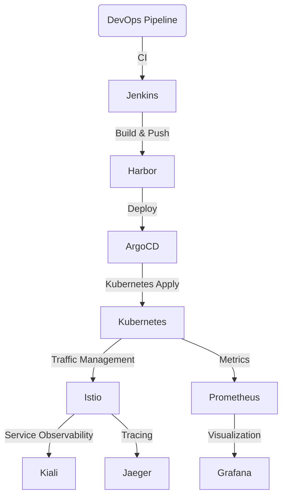

# 📌 Kubernetes 기반 CI/CD 및 모니터링 자동화 프로젝트

## 📝 프로젝트 개요
이 프로젝트는 **Kubernetes, ArgoCD, Istio**를 활용하여 **CI/CD 및 모니터링 환경을 자동화**하는 것을 목표로 합니다. 단순한 CI/CD 구축을 넘어, **서비스 운영 및 모니터링까지 고려한 DevOps 환경을 구축**하는 것이 핵심입니다.

## 🎯 주요 목표
- **Terraform & Ansible을 활용한 인프라 자동화**
- **Jenkins, GitLab, Harbor, ArgoCD를 활용한 CI/CD 파이프라인 구축**
- **Istio를 통한 서비스 메쉬 및 트래픽 관리 적용 (카나리 배포 포함)**
- **Prometheus, Grafana, Kiali, Jaeger를 이용한 모니터링 시스템 구축**
- **GitOps 방식의 배포 전략 적용**

## 🛠 사용 기술 스택
| 분야 | 사용 기술 |
|------|-----------|
| **인프라 자동화** | Terraform, Ansible |
| **CI/CD** | Jenkins, GitLab, Harbor, ArgoCD |
| **Kubernetes** | Amazon EKS / Auto Scaling Group 기반 클러스터 |
| **서비스 메쉬** | Istio, Kiali, Jaeger |
| **모니터링** | Prometheus, Grafana |

## ⚙️ 시스템 아키텍처

## 🚀 프로젝트 주요 기능
### 1️⃣ 인프라 자동화
- Terraform을 이용하여 AWS 환경에 **동적 인프라 구성**
- Ansible을 활용한 **Kubernetes 및 Docker 환경 설정 자동화**
- 환경 비용 절감을 위해 필요 시 **리소스를 자동 생성 및 삭제**

### 2️⃣ CI/CD 파이프라인 구축
- GitLab과 Jenkins를 연동하여 **자동 빌드 및 배포 파이프라인 구성**
- Harbor(프라이빗 레지스트리)를 사용하여 **컨테이너 이미지 관리**
- ArgoCD를 통한 **GitOps 방식의 지속적인 배포 적용**

### 3️⃣ 서비스 메쉬 및 트래픽 관리
- Istio를 활용하여 **마이크로서비스 간 트래픽 관리**
- Kiali를 사용하여 **서비스 간 네트워크 흐름을 시각화**
- 카나리 배포를 활용하여 **점진적 배포 전략 적용**

### 4️⃣ 모니터링 및 로깅 시스템 구축
- Prometheus를 활용한 **Kubernetes 클러스터 및 애플리케이션 모니터링**
- Grafana를 이용해 **Prometheus 데이터를 기반으로 대시보드 구성**
- Jaeger를 활용한 **분산 트레이싱 및 성능 분석**

## 📊 Grafana 대시보드 구성
본 프로젝트에서는 **기본 템플릿이 아닌, Prometheus Query를 직접 작성하여 Grafana 대시보드를 설계**하였습니다. 이를 통해 **운영 환경에 최적화된 지표를 시각화**하고, 실질적인 성능 분석이 가능하도록 구성하였습니다.

## 🏆 프로젝트 결과
- **CI/CD 자동화 구축 완료 (빌드 → 테스트 → 배포 자동화)**
- **배포 시간을 단축하고, 환경 생성 속도를 1시간 이내로 최적화**
- **인프라 자동화를 통해 서버 비용 30% 절감**
- **Grafana, Prometheus, Kiali, Jaeger를 활용하여 실시간 모니터링 및 장애 분석 가능**
- **GitOps 및 Istio 기반의 트래픽 제어를 적용하여 안정적인 배포 환경 구축**

## 📌 향후 개선 사항
- **Multi-Cluster 환경에서 Istio 및 ArgoCD 운영 테스트**
- **Prometheus Alertmanager 연동하여 실시간 알람 시스템 추가**
- **Argo Rollouts를 활용한 Progressive Delivery 적용**
- **RBAC 및 보안 강화를 위한 Vault, OPA(Open Policy Agent) 도입 검토**

## 📖 참고 자료
- [Terraform 공식 문서](https://developer.hashicorp.com/terraform/docs)
- [Ansible 공식 문서](https://docs.ansible.com/)
- [ArgoCD 공식 문서](https://argo-cd.readthedocs.io/en/stable/)
- [Istio 공식 문서](https://istio.io/latest/docs/)
- [Prometheus 공식 문서](https://prometheus.io/docs/)
- [Grafana 공식 문서](https://grafana.com/docs/)

## 👨‍💻 프로젝트 담당자
- **작성자:** [Hansol Choi]
- **GitHub:** [https://github.com/kiefersol/)]
- **Email:** [kiefer.sol96@gmail.com]
